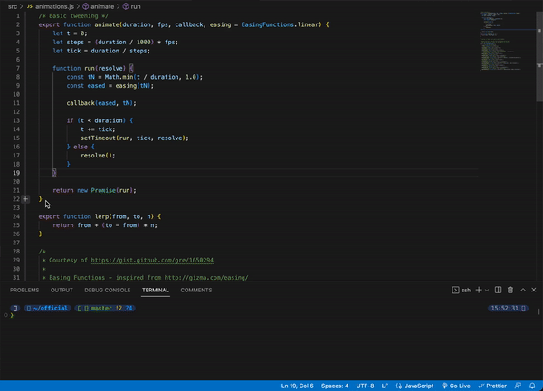
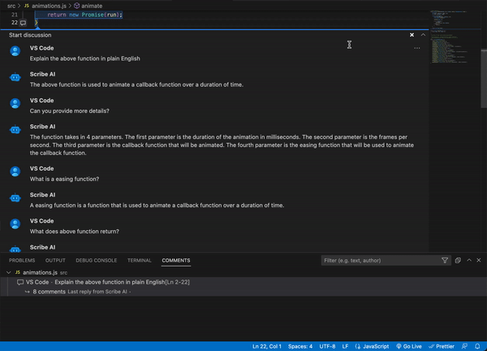
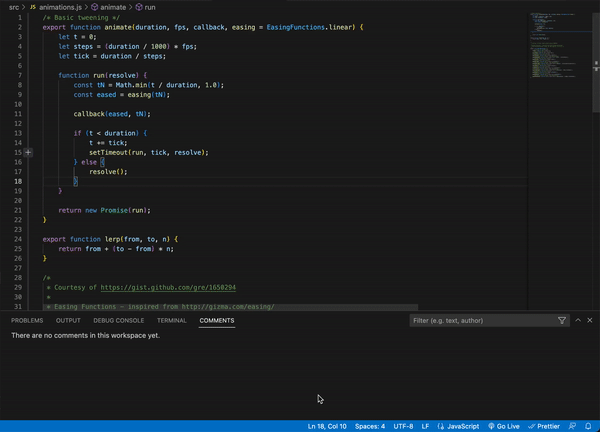
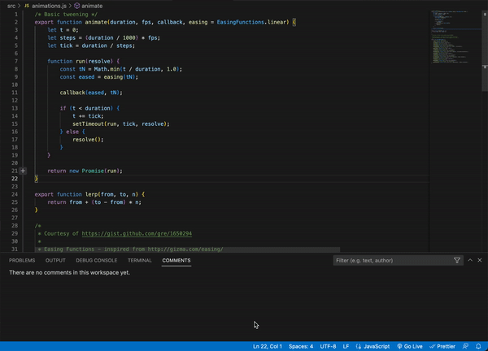
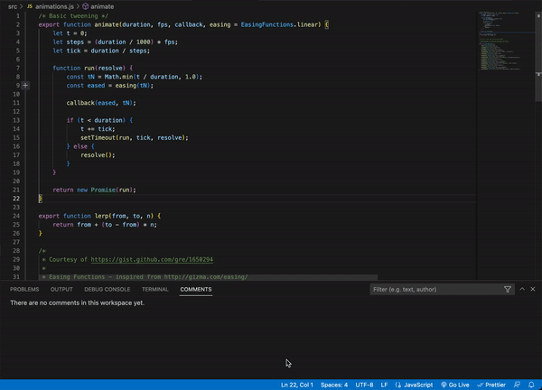
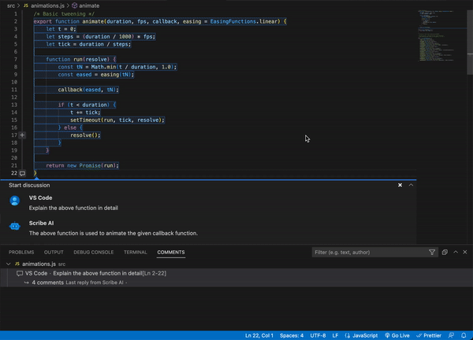
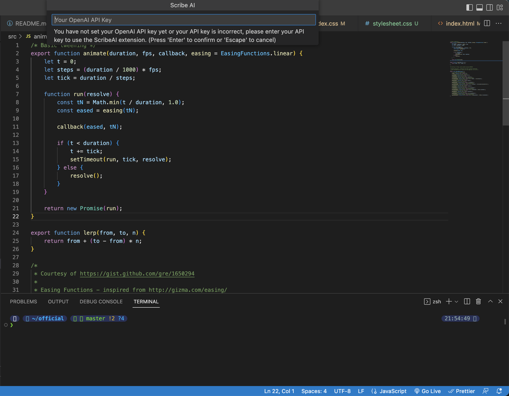
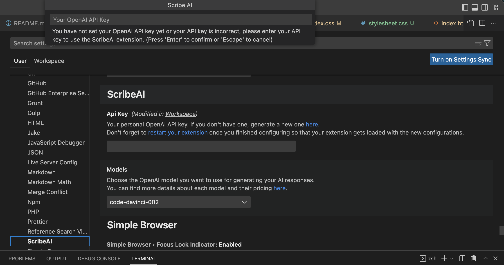

    

<h1 align="center">Scribe AI</h1>

<h4 align="center">
  <a href="https://github.com/ajikan/ScribeAI#-features">Features</a>
  ·
  <a href="https://github.com/ajikan/ScribeAI#-getting-started">Getting Started</a>
  ·
  <a href="https://github.com/ajikan/ScribeAI#%EF%B8%8F-support-and-gratitude">Support and Gratitude</a>
</h4>

Scribe AI is a ChatGPT extension for VS Code. Now you can have ChatGPT right in VS Code! Use it as your AI programming assistant which you can talk with to understand complex code, modify and improve your code, or generate comments for your code. The possibilities are endless. To start, highlight a piece of code and click on the chat icon on the left to start talking with Scribe AI just like in ChatGPT! All your conversations are saved in your workspace so you can look back on them as notes.

&nbsp;

# 🌟 Preview

  

&nbsp;

# ✨ Features
-	💬 **Ask AI:** Highlight a piece of code, click on the chat icon, and type in any questions you might have about the code such as `Explain the code`. Then hit `Ask AI` button! The AI will respond back to you with the response. You can continue to reply to the AI’s response and hold a conversation with the AI just like in ChatGPT! The conversation context is maintained between queries. The conversation will be saved in your workspace and you can close it and open it anytime. You can also edit your comments and delete them. 

  

***Editing:***

  

&nbsp;

-	🧠 **AI Edit:** Highlight a piece of code and click on the chat icon, then enter the instruction on how you want the AI to modify the code such as `Refactor the code to include comments`, `Rewrite the code in Python`, and much more! The possibilities are endless. Now finally hit `AI Edit` button and you will see that your selected code has been modified. If you don’t like the result you can always Undo it by pressing `Mac:` <kbd>⌘ Command</kbd> + <kbd>Z</kbd>, `Windows:` <kbd>Ctrl</kbd> + <kbd>Z</kbd> or go to `Edit -> Undo`. Sometimes the formatting of the result is not correct or your originally highlighted section gets messed up, in such cases you can rehighlight the code and ask AI to `Reformat the code so that it’s correct` and press the `AI Edit` button.

***Refactoring:***

  

***Rewriting in another lanugage:***

  

***Adding docstring:***

  

***Fixing mistakes:***

  

&nbsp;

-	📝 **Note Taking:** You can also add notes inside your conversation by typing your note and pressing `Create Note`. Your notes won’t get sent over to AI.

  

&nbsp;

# 🚀 Getting Started
## Installation
- To use this extension, install it from the VSCode marketplace or download and install `.vsix` file from Releases.

- When you first use ScribeAI whether by `Ask AI` or `AI Edit`, it will ask you for your OpenAI API key. This is used by the extension to access the API and is only sent to OpenAI.

  

- You can also change your API key in User Settings via `Code` -> `Preferences` -> `Settings` and under `Extensions` you will find `ScribeAI` settings. Or you can just search `ScribeAI` in search box.

  

	To find your OpenAI API key:
	1. Go to https://beta.openai.com/account/api-keys. You will need to log in (or sign up) to your OpenAI account.
	2. Click "Create new secret key", and copy it.
	3. You should then paste it into VS Code when prompted.

- If you wish to change the AI model you use which by default is `code-davinci-002` (because it’s free currently), then you can change it in User Settings.
- 💥 Remember to reset your extension and workspace when you change your settings. You can do that by clicking on `restart your extension` in the API key settings 💥

&nbsp;

> **Note**  
> Temporarily, the extension is using Codex, a similar GPT model by OpenAI, instead of ChatGPT, since the official ChatGPT API is not out yet. We do this because using unofficial ChatGPT API is unsupported by OpenAI and it's not reliable. Our team has figured out a way to simulate ChatGPT using OpenAI's current available GPT models. You can choose between `code-davinci-002` and `text-davinci-003` in the User Settings. When the official ChatGPT API is out our team will immediately offer an option to choose the ChatGPT model.

&nbsp;

# ❤️ Support and Gratitude
- This wouldn't have been possible without OpenAI's API to access its AI services.
- I want to thank the wonderful VS Code community and all the developers that maintain VS Code.
- If you like this extension and found it useful, please consider donating me as I am only a new grad developer and any amount of donation will be of tremendous help and encourage me to keep going.